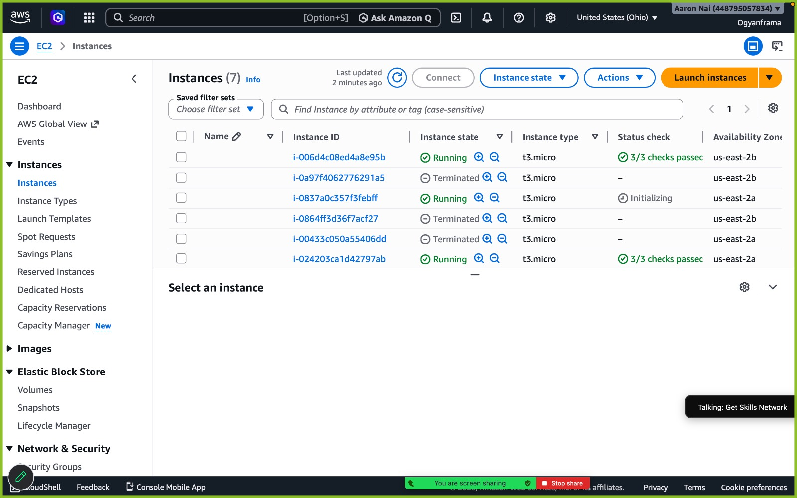

# ☁️ Auto-Scaling Web App with Application Load Balancer (AWS)

Deployed a fault-tolerant, self-healing web application on AWS that automatically scales from **2 to 6 EC2 instances** based on real-time CPU load — the same architecture pattern used by Netflix, Spotify, and Airbnb to handle traffic spikes.


---

## 📌 Project Overview

Traffic isn't constant — a real production system needs to survive both a quiet Tuesday morning and a viral spike. This project simulates that reality: I built a highly available web tier that detects load and reacts to it automatically, with zero manual intervention.

**The problem this solves:** a single EC2 instance is a single point of failure and can't handle sudden demand. This architecture removes both risks by distributing traffic across multiple instances and dynamically adding/removing capacity based on CPU utilization.

## 🏗️ Architecture

```
                         ┌─────────────────────┐
        Internet  ──────▶│   Application Load   │
                         │   Balancer (ALB)     │
                         └──────────┬───────────┘
                                    │
                     ┌──────────────┴──────────────┐
                     │     Target Group (HTTP:80)   │
                     └──────────────┬──────────────┘
                                    │
              ┌─────────────────────┼─────────────────────┐
              │                     │                      │
        ┌─────▼─────┐       ┌───────▼───────┐      ┌───────▼───────┐
        │  EC2 #1    │       │   EC2 #2       │      │  EC2 #3 (+)    │
        │  AZ: -1a   │       │   AZ: -1b      │      │  scales in on   │
        │  nginx     │       │   nginx        │      │  CPU > 50%      │
        └────────────┘       └────────────────┘      └────────────────┘
                     ▲                     ▲
                     └────────┬────────────┘
                    Auto Scaling Group (min:2 desired:2 max:6)
                    Target tracking policy: avg CPU > 50%
                    Monitored via CloudWatch
```

## 🔧 What I Built

| Component | Purpose |
|---|---|
| **Launch Template** | Blueprint for EC2 instances — Amazon Linux 2023, `t2.micro`, bootstrapped via user-data script (installs & configures nginx automatically) |
| **Target Group** | Health-checked pool of instances the ALB routes traffic to (`/` health check, 30s interval) |
| **Application Load Balancer** | Internet-facing ALB spanning 2 Availability Zones for high availability |
| **Auto Scaling Group** | Maintains 2–6 instances; target-tracking policy scales out when average CPU > 50% |
| **CloudWatch** | Supplies the CPU metric that drives the scaling policy |

## ⚙️ How It Works

1. The ALB receives all incoming traffic and distributes it across healthy instances in the target group.
2. The ASG keeps a minimum of 2 instances running across 2 AZs at all times, so a single AZ outage doesn't take the app down.
3. When I generated artificial load with the `stress` tool, average CPU crossed the 50% threshold and CloudWatch triggered the scaling policy.
4. The ASG launched new instances automatically, registered them with the target group, and the ALB began routing traffic to them within minutes.
5. Once load dropped, the ASG scaled back in to the desired capacity of 2 — no manual cleanup needed for the app tier.

## 📸 Evidence


*EC2 console showing the ASG cycling instances — a mix of Running and Terminated states reflects scale-out and scale-in activity during load testing.*S learning journey — [cloudwithshad](https://github.com) cloud bootcamp.*
